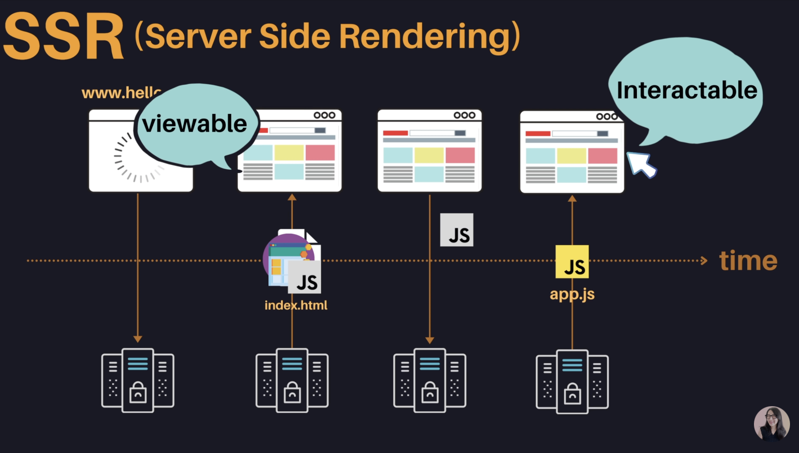
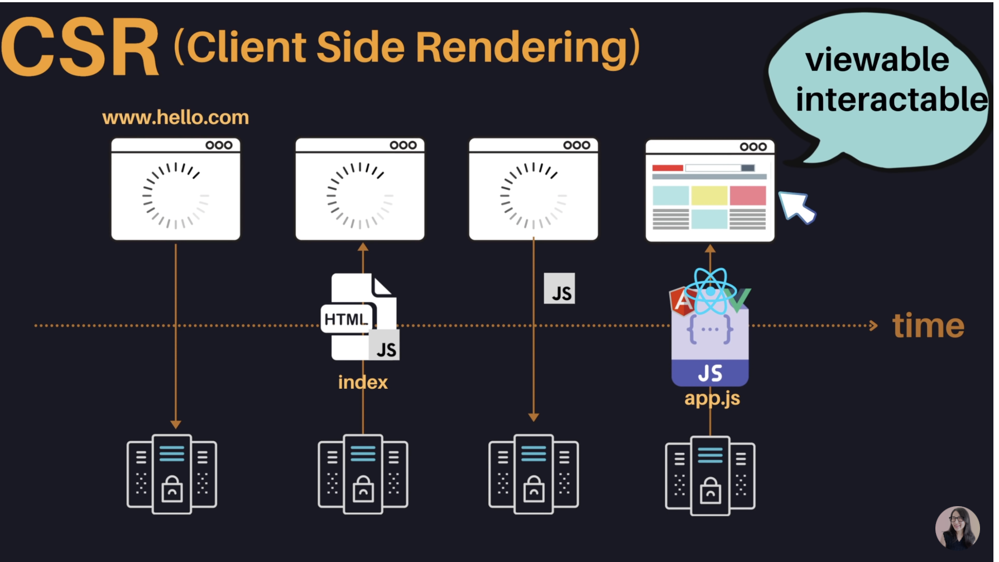

# SSR, CSR

렌더링을 누가 하느냐에 따라 SSR, CSR로 나뉘게 된다.

쉽게 생각하면 html을 뼈대만 받고 브라우저(Client)에서 동적으로 DOM을 그리면 CSR이고 다 그려진 DOM을 받게 되면 SSR이다.

 

## 🌞 SSR(Server Side Rendering)

- 웹 페이지의 렌더링을 서버에서 처리해준다.
- 서버에서 사용자에게 보여줄 페이지를 모두 구성해 보여주는 방식
- 서버를 이용해 페이지를 구성하기 때문에 CSR보다 페이지 구성 속도는 느리지만 전체적으로 사용자에게 보여주는 컨텐츠 구성이 완료되는 시점을 빨라진다
- 모든 컨텐츠가 HTML에 담겨 있기 때문에 SEO 부분에서 CSR보다 효율적이다.
- 사용자가 클릭을 할 때마다 전체적인 웹사이트를 다시 서버에서 받아오기 때문에 깜빡힘 현상(좋지 않은 UX)과 서버가 과부하가 걸리기 쉽다.
- 사용자가 빠르게 웹사이트를 확인할 수 있지만 동적으로 데이터를 처리하는 자바스크립트를 다운로드 받지 못해 반응이 없을 수도 있다.
- 사용자가 화면을 볼 수 시간(TTV)과 인터랙션할 수 있는 시간(TTI) 사이에 공백이 있다.

 

  

## 🌝 CSR(Client Side Rendering)

- 웹 페이지의 렌더링이 클라이언트(브라우저)에서 일어난다
- 브라우저는 최초 요청에서 html, js, css 확장자의 파일을 다운로드
- 최초로 불러온 html의 내용은 비어 있음(html, body 태그만 존재) => SEO에 취약
- 자바스크립트 파일을 다운로드 한뒤 html에 렌더링을 한다.
- 페이지 이동 시 추가 html 파일 요청이 아니라 자바스크립트를 이용하여 렌더링
- SSR보다 초기 전송되는 페이지의 속도는 빠르지만 서비스에서 필요한 데이터를 클라이언트에서 추가로 요청하여 재구성해야 하기 때문에 전체적인 페이지 완료 시점은 SSR보다 느리다
- 사용자가 웹사이트를 볼 수 있을 때(TTV) 인터랙션(TTI)이 가능하다.

 

 

### SEO 대응

검색 엔진 최적화에서 SSR은 서버 측에서 페이지를 전부 보내주기 때문에 HTML 안에 콘텐츠가 포함되어 있어 검색엔진 최적화가 가능하지만 CSR 방식은 클라이언트 측에서 페이지를 구성하기 전까지는 HTML에 데이터가 없기 때문에 SSR 방식이 검색 엔진 최적화에 문제가 생긴다.

> Next.js를 사용하는 주된 이유 중 하나가 SSR 환경을 편리하게 설정해주고, SEO 최적화에 장점을 가진다.

  

> 출처  
> https://higher77.tistory.com/91 
> https://medium.com/walmartglobaltech/the-benefits-of-server-side-rendering-over-client-side-rendering-5d07ff2cefe8 
> https://tech.weperson.com/wedev/frontend/csr-ssr-spa-mpa-pwa/#csr-client-side-rendering-vs-ssr-server-side-rendering 
> https://d2.naver.com/helloworld/7804182 
> https://onlyfor-me-blog.tistory.com/387 
> https://youtu.be/iZ9csAfU5Os
